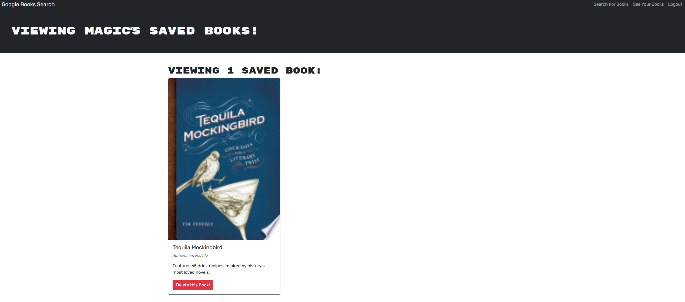

# Google-Books

Search and keep records of books to read with this intuitive app! Refactored from a RESTful API to a GraphQL API. Check out the deployed application on [Render](https://google-books-b9t7.onrender.com/)!

## Description

Google-Books is a full-stack MERN application that allows users to search for books using the Google Books API and save their favorite books to a personal list. Users can create an account, log in, and manage their saved books. The app uses GraphQL for API queries and mutations, providing a modern and efficient way to interact with the backend.

## Features

- User authentication with JWT
- Search for books using the Google Books API
- Save and manage favorite books
- Responsive design with React Bootstrap

## Technologies

- **Frontend**: React, TypeScript, Apollo Client, React Bootstrap
- **Backend**: Node.js, Express, MongoDB, Mongoose, Apollo Server, GraphQL
- **Authentication**: JSON Web Tokens (JWT)
- **Build Tools**: Vite, TypeScript

## Screenshot

